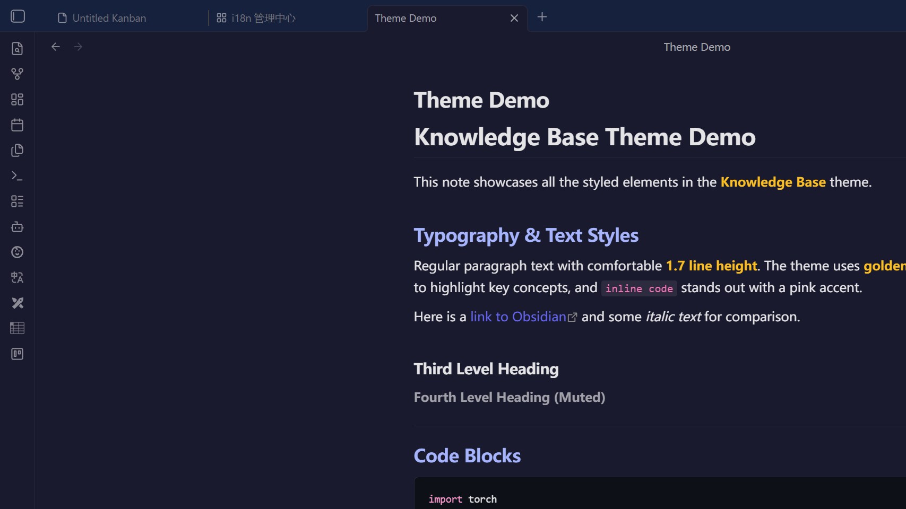
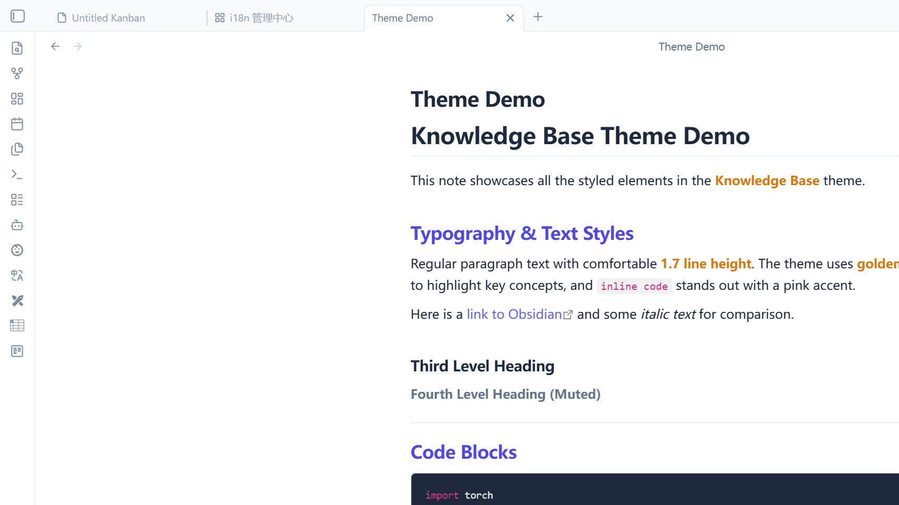

# Knowledge Base — Obsidian Theme


A developer-friendly Obsidian theme with **indigo-purple accents**, **golden bold text**, and **pink inline code**. Ported from a custom-built web knowledge base system, optimized for programmers and educators.

一款为程序员和教学场景设计的 Obsidian 主题。深色模式采用深邃靛蓝配色，亮色模式清爽优雅。源自个人开发的 Web 知识库系统，完美移植到 Obsidian 生态。

---

## Screenshots

| Dark Mode | Light Mode |
|-----------|------------|
|  |  |

---

## Features

### Typography
- **H1** — Large with bottom border separator
- **H2** — Indigo-blue `#a5b4fc` (dark) / Deep purple `#4f46e5` (light)
- **H3** — Clean and balanced
- **H4** — Muted for secondary headings

### Syntax Highlighting
- **Bold text** — Golden yellow `#fbbf24` (dark) / Amber `#d97706` (light), makes key points pop
- **Inline code** — Pink `#f472b6` (dark) / Rose `#db2777` (light), never lost in text again
- **Code blocks** — Dark background `#0d1117` with rounded borders, GitHub-style

### Content Elements
- **Blockquotes** — Purple left border + translucent purple background
- **Tables** — Zebra striping + row hover highlight
- **Images** — Rounded corners (`6px`)
- **Horizontal rules** — Subtle border style

### UI Polish
- **Scrollbars** — Ultra-thin 6px minimal scrollbar
- **Sidebar** — Purple hover effects, active file highlight
- **Tags** — Purple capsule style
- **Checkboxes** — Accent-colored when checked
- **Mermaid diagrams** — Auto-adapted white text/lines in dark mode

---

## Color Palette

### Dark Mode

| Element | Color | Hex |
|---------|-------|-----|
| Background |  Deep Indigo | `#1a1a2e` |
| Secondary BG |  Navy Blue | `#16213e` |
| Accent |  Indigo Purple | `#6366f1` |
| Bold Text |  Golden Yellow | `#fbbf24` |
| Inline Code |  Pink | `#f472b6` |
| H2 Heading |  Light Indigo | `#a5b4fc` |

### Light Mode

| Element | Color | Hex |
|---------|-------|-----|
| Background |  White | `#ffffff` |
| Secondary BG |  Slate 50 | `#f8fafc` |
| Accent |  Indigo Purple | `#6366f1` |
| Bold Text |  Amber | `#d97706` |
| Inline Code |  Rose | `#db2777` |
| H2 Heading |  Deep Indigo | `#4f46e5` |

---

## Installation

### From Community Themes (coming soon)
1. Open Obsidian → **Settings** → **Appearance** → **Themes** → **Manage**
2. Search for `Knowledge Base`
3. Click **Install and use**

### Manual Installation
1. Download the [latest release](https://github.com/cheer932041235/obsidian-knowledge-base-theme/releases)
2. Extract the files into your vault's `.obsidian/themes/Knowledge Base/` directory
3. Open Obsidian → **Settings** → **Appearance** → **Themes** → Select **Knowledge Base**

---

## Customization

All colors are defined as CSS variables at the top of `theme.css`. You can override them with a CSS Snippet:

1. Create a file in `.obsidian/snippets/my-overrides.css`
2. Add your overrides:

```css
.theme-dark {
  --kb-heading2: #60a5fa;    /* Change H2 to blue */
  --kb-strong: #f97316;       /* Change bold to orange */
  --kb-inline-code: #a78bfa;  /* Change inline code to violet */
  --kb-accent: #8b5cf6;       /* Change accent to purple */
}
```

3. Enable the snippet in **Settings** → **Appearance** → **CSS snippets**

### Available CSS Variables

| Variable | Dark | Light | Description |
|----------|------|-------|-------------|
| `--kb-accent` | `#6366f1` | `#6366f1` | Global accent color |
| `--kb-heading2` | `#a5b4fc` | `#4f46e5` | H2 heading color |
| `--kb-strong` | `#fbbf24` | `#d97706` | Bold text color |
| `--kb-inline-code` | `#f472b6` | `#db2777` | Inline code color |
| `--kb-inline-code-bg` | `rgba(255,255,255,0.08)` | `rgba(0,0,0,0.05)` | Inline code background |
| `--kb-pre-bg` | `#0d1117` | `#1e293b` | Code block background |
| `--kb-blockquote-bg` | `rgba(99,102,241,0.08)` | `rgba(99,102,241,0.06)` | Blockquote background |
| `--kb-blockquote-border` | `#6366f1` | `#6366f1` | Blockquote left border |
| `--kb-link` | `#6366f1` | `#6366f1` | Link color |
| `--kb-border` | `#27273a` | `#e2e8f0` | Border color |
| `--kb-bg-editor` | `#0d1117` | `#ffffff` | Editor background |

---

## Compatibility

- **Obsidian** v1.0.0+
- **Modes**: Dark mode ✅ Light mode ✅
- **Platforms**: Windows ✅ macOS ✅ Linux ✅
- **Plugins**: Compatible with most community plugins

---

## Use Cases

- 🖥️ **Programming notes** — Code blocks and inline code are visually distinct
- 🎓 **Teaching materials** — Bold highlights make key concepts stand out
- 📖 **Technical documentation** — Tables with zebra stripes improve readability
- ✍️ **Daily writing** — Clean typography with comfortable line height

---

## Contributing

Contributions are welcome! To contribute:

1. Fork this repository
2. Create a feature branch (`git checkout -b feature/my-improvement`)
3. Commit your changes (`git commit -m 'Add: description'`)
4. Push to the branch (`git push origin feature/my-improvement`)
5. Open a Pull Request

### Adding Screenshots

If you'd like to help add screenshots:
1. Apply the theme in Obsidian
2. Open a note with varied Markdown elements (headings, code, tables, quotes, etc.)
3. Capture both dark and light mode screenshots
4. Name them `screenshot-dark.png` and `screenshot-light.png`

---

## Origin

This theme was ported from a custom-built local web knowledge base application by [@cheer932041235](https://github.com/cheer932041235). The original CSS was designed for a Node.js + vanilla JS app and has been adapted to work with Obsidian's DOM structure.

## License

[MIT](LICENSE) — free to use, modify, and distribute.
